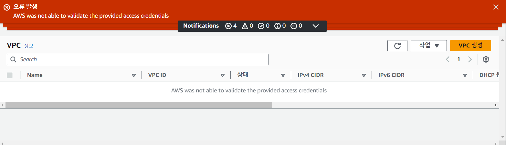

------------------------------------------------------------------------

## 1. 개요

AWS 부과 요금을 확인하려는데   Access denied가 뜨고 확인 할 수 없는 상황이 되었다. 
  

VPC도 그렇고
  

콘솔 창도 전부 확인 할 수 없는 상황이 되었다. 
도대체 왜 갑자기 AWS 정보가 나오지 않는 것인가? 의문을 갖고 오류 발생 경고를 유심히 확인하면서 하나하나 트러블슈팅에 나섰다.
  

## 2. 해결 과정
  
### 1. AWS 안내 먼저 따라가보기

처음 Access denied 경고창에서 봤던 링크로 따라가봤다. 들어가 글을 쭉 읽다 보니 하나 추천해주는 게 있었다.
  
### 2. IAM policy simulator

IAM 자격을 체크하는 프로그램인데 한 번에 확인하기 좋은 거 같아 한 번 확인해 봤다.
  

Access denied 경고창에 문제로 나왔던 Cost explorer를 확인해봐도 별 이상이 없었다...
  
### 3. 시간 동기화

AWS was not able to validate provided access credentials.

유난히 거슬렸던 경고문을 가지고 구글링 한 결과 aws configure 된 시간과 내 시스템 시간이 서로 차이가 클 경우 발생 할 수 있는 에러라는 걸 확인했다. 
  

그러고 내 윈도우 시간을 확인 해보니 왠걸 내 시간이 오전 6시 37으로 되어 있었다.
  

 혹시 몰라 구글에서 time으로 시간 확인해보니 역시 차이가 많이 난다.
  

설정 > 시간 및 언어 > 날짜 및 시간에서 자동으로 시간 설정을 보니 켜져있는 상태였으니 다시 껐다가 켜주니
  

이렇게 시간이 원래대로 돌아왔다. 그렇게 다시 AWS에 접속해 확인해 본 결과
  

## 3. 결과

과금 정보 잘 나오고
  

VPC 정보 잘 나오고
  

콘솔 정보도 아주 잘 나오는 걸 볼 수 있다.
생각보다 쉽게 해결할 수 있어서 아주 다행이었다.