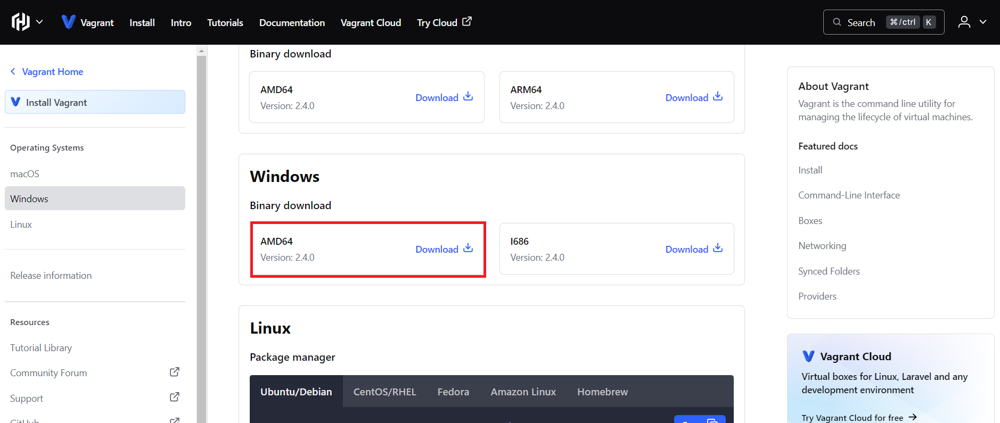
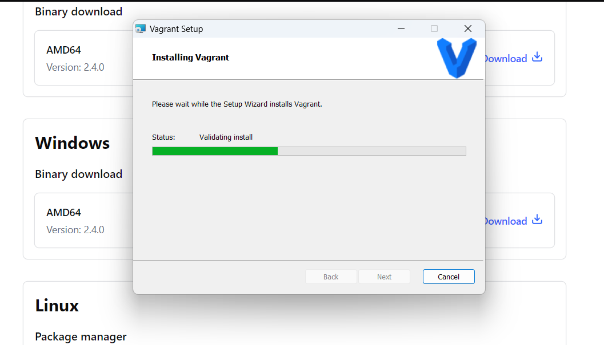
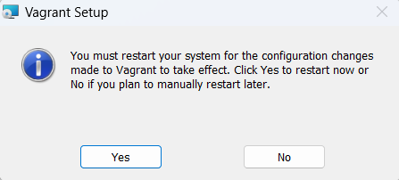
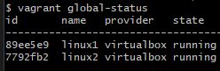
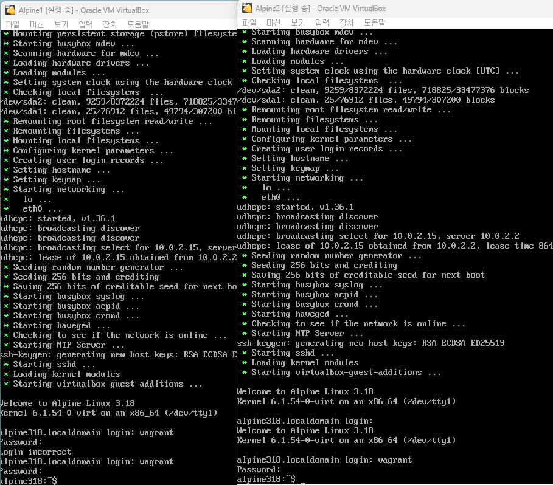
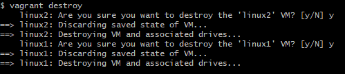

# vagrant_alpine_docker_simpleLogic

## 1. vagrant download
 

  
Vagrant 공식홈페이지에서 Window용 msi 파일을 다운 받는다.
  

  
next 누르고 바로 설치하고나서
  

 
시스템을 다시시작해준다.
 

## 2. Vagrantfile 있는 폴더에서 git bash 열기
 
리눅스 명령어 사용을 위해 Vagrantfile이 있는 폴더에서 우클릭하여 git bash를 실행한다.
 

## 3. vagrant global-status로 전역상태 확인
 

 
vagrant global-status 명령어로 box를 검색하니 아직 실행한 적이 없어 나오지 않는 걸 알 수 있다.
 

## 4. vagrant up
 
vagrant를 실행한다.

## 5. virtual box에서 alpine linux 실행 확인
 

 

 
이렇게 virtual box에 alpine linux가 생성 된 것을 확인 할 수 있다. 기본 아이디 패스워드는 vagrant로 로그인 할 수 있다.

## 6. vagrant global-status
 

 
이렇게 동작하는 걸 확인 할 수 있다.

## 7. vagrant halt(stop)
 
사용하지 않는다면 이렇게 stop 명령어를 주고

## 8. vagrant detroy
 

 
destroy 명령어로 둘 다 삭제 할 수 있다.